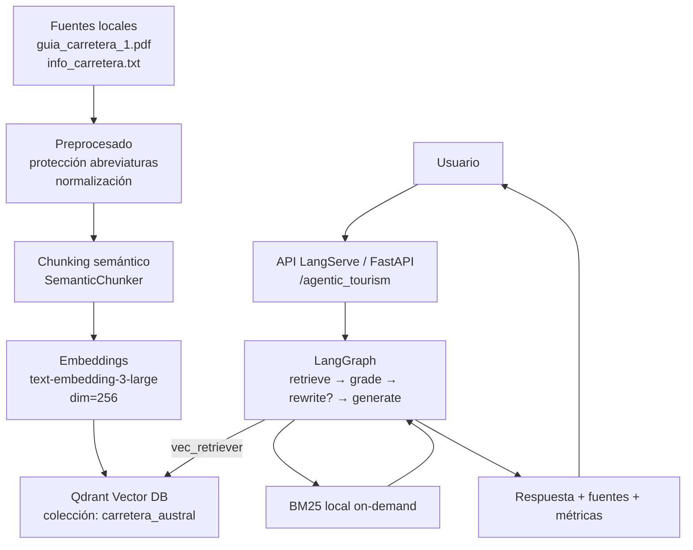
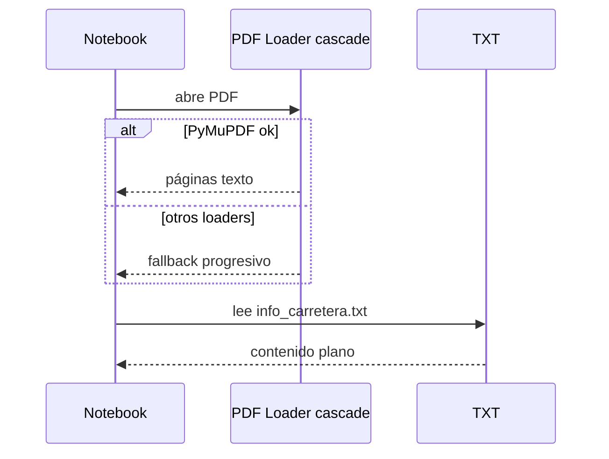
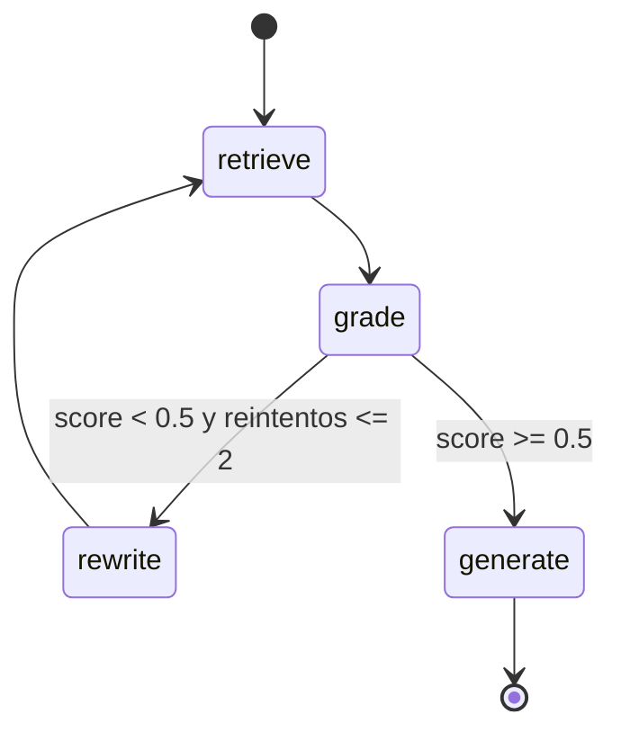
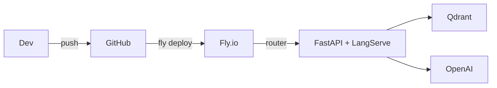

## RAG Agentic Carretera Austral (LangGraph + LangServe + Qdrant)

Este repositorio contiene un sistema RAG agentic especializado en turismo para la Carretera Austral (Ruta 7, Patagonia, Chile). Incluye:

- `Agentic_RAG_Carretera_Austral.ipynb`: Notebook que crea/actualiza la colección en Qdrant y valida el flujo de recuperación–generación.
- `server.py`: API basada en FastAPI y LangServe que consume una colección existente de Qdrant (sin reindexar) y ejecuta el grafo agentic de LangGraph.
- `requirements.txt`: Dependencias exactas probadas.
- `fly.toml`: Configuración de despliegue en Fly.io.
- `info_carretera.txt` y `guia_carretera_1.pdf`: Fuentes documentales utilizadas en el índice (PDF + texto guía).

### Visión general



- Recuperación híbrida 2 etapas: vectorial (Qdrant, MMR) + re-ranqueo léxico local (BM25 sobre candidatos). No se usa BM25 global para evitar costos de memoria.
- Grafo agentic: si los documentos recuperados tienen baja calidad, reescribe la consulta y reintenta antes de generar.
- API con LangServe: expone un runnable en `/agentic_tourism` para uso programático y streaming.
- Despliegue: Fly.io con `uvicorn` escuchando en el puerto `8000`.

---

## 1) Notebook: cómo se construye el índice y el grafo

Archivo: `Agentic_RAG_Carretera_Austral.ipynb`

### 1.1 Configuración y credenciales
- Carga variables de entorno con `dotenv` y valida: `OPENAI_API_KEY`, `QDRANT_URL`, `QDRANT_API_KEY`.
- Define rutas locales a las fuentes: `guia_carretera_1.pdf` y `info_carretera.txt`.
- Nombre de colección por defecto: `carretera_austral`.

```python
# Credenciales requeridas
required_keys = ["OPENAI_API_KEY", "QDRANT_URL", "QDRANT_API_KEY"]
missing = [k for k in required_keys if not os.getenv(k)]
```

### 1.2 Ingesta de documentos
- PDF: intenta múltiples extractores en cascada (PyMuPDF → PDFPlumber → PyPDFLoader → Unstructured → pypdf → OCR EasyOCR como último recurso).
- TXT: carga directa de `info_carretera.txt`.



### 1.3 Preprocesado y chunking semántico
- Protege abreviaturas y unidades con punto (p. ej., "km.", "aprox.") para evitar cortes incorrectos.
- Divide por bloques (párrafos) y luego aplica `SemanticChunker` (percentil 95, `min_chunk_size=180`, buffer semántico).

Pseudocódigo clave:

```python
semantic_chunker = SemanticChunker(
  embeddings,
  buffer_size=2,
  breakpoint_threshold_type="percentile",
  breakpoint_threshold_amount=95,
  sentence_split_regex=r"(?<=(?<![Kk][Mm])[.?!])\s+",
  min_chunk_size=180,
)
chunks = semantic_chunker.split_documents(documentos_preprocesados)
```

### 1.4 Creación/uso de la colección en Qdrant
- Conecta a Qdrant con `QdrantClient`.
- Lógica: si existe la colección y `RECREATE_COLLECTION=False` → conecta; si no existe o se fuerza recreación → borra/crea y reindexa con chunks.
- Enriquecimiento de metadatos en chunks: `source_title`, `collection`, `chunk_id`, `categoria`, `char_count`.

### 1.5 Retriever híbrido (vectorial + BM25 local)
- Vectorial: `vector_store.as_retriever(search_type="mmr", k=8, fetch_k=40, lambda_mult=0.5)`.
- Léxico: `BM25Retriever.from_documents(vec_docs, k=6, preprocess_func=simple_preprocess)` calculado on-demand sobre candidatos.

### 1.6 Grafo agentic (LangGraph)
- Estado: `query`, `original_query`, `documents`, `sources`, `doc_quality_score`, `retrieval_attempts`, `should_rewrite`, `answer`, `workflow_steps`, `total_tokens`.
- Nodos:
  - `retrieve`: recupera vec_docs → normaliza → BM25 local → fusiona sin duplicados → limita a 8.
  - `grade`: calcula `doc_quality_score` por similitud media de embeddings; si < 0.5, activa `should_rewrite`.
  - `rewrite`: reescribe consulta con LLM económico.
  - `generate`: responde solo con el contexto disponible, citando fuentes y reglas anti-alucinación.
- Transiciones: `retrieve → grade → (rewrite → retrieve)* → generate → END`.



### 1.7 Ejecución y evaluación
- Helper `run_agentic_tourism_rag()` para lanzar el grafo y medir tokens/tiempo.
- Evaluación opcional con `ragas` (faithfulness, relevancy, context precision/recall, correctness si hay ground truths).

---

## 2) API: `server.py` con LangServe

Archivo: `server.py`

### 2.1 Variables de entorno
- Requeridas: `OPENAI_API_KEY`, `QDRANT_URL`, `QDRANT_API_KEY`.
- Opcionales: `QDRANT_COLLECTION` (default: `carretera_austral`), `OPENAI_CHAT_MODEL` (default: `gpt-4o-mini`).

### 2.2 Modelos y almacenamiento
- Embeddings: `text-embedding-3-large` con `dimensions=256` (debe coincidir con la colección existente).
- LLM: `ChatOpenAI` (modelo configurable por env), temperatura 0.
- Vector store: `QdrantVectorStore` apuntando a la colección existente (no reindexa en producción).

### 2.3 Retriever híbrido y nodos
- Vectorial MMR (k=8, fetch_k=40, lambda=0.5) + BM25 local on-demand sobre candidatos.
- Nodos iguales al notebook: `retrieve`, `grade`, `rewrite`, `generate`.

### 2.4 Runnable y rutas LangServe
Se expone un `RunnableLambda` que acepta `str` o `{ "query": str }` y devuelve:
`{"answer": str, "sources": List[str], "workflow_steps": List[str], "total_tokens": int, "execution_time": float}`.

Rutas (por defecto de LangServe):
- `POST /agentic_tourism/invoke` → invocación simple.
- `POST /agentic_tourism/stream` → streaming SSE.
- `GET /` y `GET /docs` → descripción FastAPI.

Ejemplo de invocación local:

```bash
curl -X POST http://localhost:8000/agentic_tourism/invoke \
  -H "Content-Type: application/json" \
  -d '{"input": {"query": "¿Dónde están las Termas del Amarillo?"}}'
```

---

## 3) Puesta en marcha local

### 3.1 Requisitos
- Python 3.10+ recomendado
- Acceso a Qdrant (Cloud o self-hosted) con una colección ya creada para producción. Si no existe, crea la colección con el notebook.

### 3.2 Instalación

```bash
python -m venv .venv && source .venv/bin/activate
pip install -U pip
pip install -r requirements.txt
```

### 3.3 Variables de entorno

```bash
export OPENAI_API_KEY=sk-xxx
export QDRANT_URL="https://<tu-qdrant>.io"
export QDRANT_API_KEY="qdrant_XXX"
# Opcional
export QDRANT_COLLECTION="carretera_austral"
export OPENAI_CHAT_MODEL="gpt-4o-mini"
```

### 3.4 Ejecutar servidor

```bash
uvicorn server:app --host 0.0.0.0 --port 8000 --reload
```

Probar:

```bash
curl -X POST http://localhost:8000/agentic_tourism/invoke \
  -H "Content-Type: application/json" \
  -d '{"input": "Itinerario de ferries en el tramo Chaitén–La Junta"}'
```

---

## 4) Despliegue en Fly.io

Archivo: `fly.toml` (app: `rag-langgraph-carretera`, puerto interno 8000)

### 4.1 Prerrequisitos
- Tener `flyctl` instalado y autenticado: `fly auth login`.
- Tener variables de entorno listas como secretos.

### 4.2 Configuración de secretos

```bash
fly secrets set \
  OPENAI_API_KEY=sk-xxx \
  QDRANT_URL=https://<tu-qdrant>.io \
  QDRANT_API_KEY=qdrant_XXX \
  QDRANT_COLLECTION=carretera_austral \
  OPENAI_CHAT_MODEL=gpt-4o-mini
```

### 4.3 Despliegue

```bash
fly apps create rag-langgraph-carretera || true
fly deploy --build-only=false --detach
fly status | cat
```

### 4.4 Probar en producción

```bash
APP_URL=$(fly info --json | jq -r '.Hostname')
curl -X POST https://$APP_URL/agentic_tourism/invoke \
  -H "Content-Type: application/json" \
  -d '{"input": {"query": "¿Me recomiendas miradores entre Puyuhuapi y Coyhaique?"}}'
```



---

## 5) Detalles de diseño importantes

- Embeddings dimension=256: la colección en Qdrant fue creada con ese tamaño; si cambias el modelo/dimensión, debes reindexar con el notebook.
- Recuperación híbrida: BM25 local evita construir un índice léxico global y reduce el consumo de memoria/tiempo en cada request.
- Reescritura controlada: solo hasta 2 reintentos y con reglas del dominio (sin inventar metas ni cambiar intención).
- Respuestas con políticas anti-alucinación: no inventar horarios/precios; citar fuentes cuando sea posible.

---

## 6) Solución de problemas

- Faltan variables de entorno: el servidor imprime advertencias al iniciar. Define `OPENAI_API_KEY`, `QDRANT_URL`, `QDRANT_API_KEY`.
- Error de colección en Qdrant: crea/recrea la colección ejecutando el notebook con `RECREATE_COLLECTION=True`.
- Modelos no disponibles: ajusta `OPENAI_CHAT_MODEL` a uno accesible en tu cuenta.
- Demasiado texto en PDF con cortes raros: revisa normalización de guiones/abreviaturas en el notebook.

---

## 7) Estructura del proyecto

```
rag_langgraph_carretera/
├─ server.py               # API LangServe/FastAPI, usa colección Qdrant existente
├─ requirements.txt        # Dependencias fijas
├─ fly.toml                # Configuración Fly.io
├─ Agentic_RAG_Carretera_Austral.ipynb  # Construcción/validación del índice y grafo
├─ info_carretera.txt      # Texto guía
├─ guia_carretera_1.pdf    # Guía en PDF (fuente)
└─ README.md               # Este documento
```

---

## 8) Licencia y uso de datos

Los documentos (`guia_carretera_1.pdf`, `info_carretera.txt`) se incluyen con fines educativos/demostrativos. Verifica derechos antes de usar en producción.


---

## 9) Estrategias de recuperación (MMR y BM25) en detalle

### 9.1 ¿Qué recupera el sistema? (unidad: chunks)
- **Unidad recuperada**: `Document` de LangChain que representa un **chunk** del corpus indexado (no documentos completos). Los chunks y su metadata (p. ej., `page`, `chunk_id`, `source_title`) fueron generados en el notebook al crear la colección en Qdrant.

### 9.2 MMR (Maximal Marginal Relevance)
- **Qué es**: técnica de selección que equilibra relevancia con la consulta y diversidad entre resultados para evitar redundancia.
- **Cómo funciona (intuición)**: selecciona iterativamente; en cada paso elige el siguiente chunk maximizando [relevancia − redundancia]. Un parámetro λ controla el balance (λ alto → más relevancia; λ bajo → más diversidad).
- **Implementación aquí**: se usa como primer filtro sobre Qdrant.
  - Configuración: `k=8`, `fetch_k=40`, `lambda_mult=0.5`.
  - Flujo: Qdrant devuelve hasta 40 candidatos por similaridad; MMR selecciona 8 finales diversos y relevantes.

### 9.3 BM25 (ranking léxico probabilístico) “local”
- **Qué es**: método clásico basado en coincidencia de términos (palabras), ponderado por frecuencia inversa de documento y normalización por longitud.
- **Por qué aquí**: complementa a la semántica con sensibilidad a frases exactas, nombres propios, números y variantes literales.
- **Implementación aquí**: BM25 se construye en memoria **solo** sobre los candidatos que trajo MMR (no sobre todo el corpus) y re‑ranquea esos candidatos.
- **Preproceso**: normaliza acentos, signos y guiones de fin de línea para no perder coincidencias (ver `simple_preprocess` y `normalize_hyphens` en `server.py`).

### 9.4 ¿Cuántos chunks toma y cómo se seleccionan?
- Paso 1 (vectorial + MMR): considera hasta **40** candidatos; selecciona **8** chunks diversos y relevantes.
- Paso 2 (BM25 local): re‑ranquea esos **8**; se toman los mejores para priorizar literalidad.
- Paso 3 (fusión + deduplicación): se combinan listas BM25 y vectorial, se eliminan duplicados por metadata y se corta a **8** finales.

Resultado: un conjunto pequeño (8) con buen balance entre cobertura semántica y coincidencias literales, ideal para limitar tokens y alucinaciones.

### 9.5 Trade‑offs y cuándo conviene
- **Recall**: MMR + BM25 suele recuperar mejor en consultas ambiguas o con sinónimos/variantes.
- **Precisión/latencia**: la etapa extra de BM25 añade algo de CPU, pero al operar sobre pocos candidatos el costo es bajo.
- **Robustez**: combinado con el nodo `grade` y la `rewrite`, mejora cuando la consulta original es vaga.

### 9.6 Parámetros útiles para tuning
- MMR:
  - `fetch_k`: 40 → 60–80 si falta cobertura temática.
  - `k`: 8 → 6–10 según límite de tokens y densidad informativa.
  - `lambda_mult`: 0.5 → 0.3–0.7 para ajustar relevancia vs diversidad.
- BM25 local:
  - `k`: 6 → 6–10 si importan más las frases exactas.
- General:
  - Ajusta tamaño/solapamiento de chunks en el índice; impacta tanto como los parámetros de recuperación.
  - La **dimensión de embeddings** debe coincidir con la colección (aquí 256); cambiarla requiere reindexar en el notebook.

